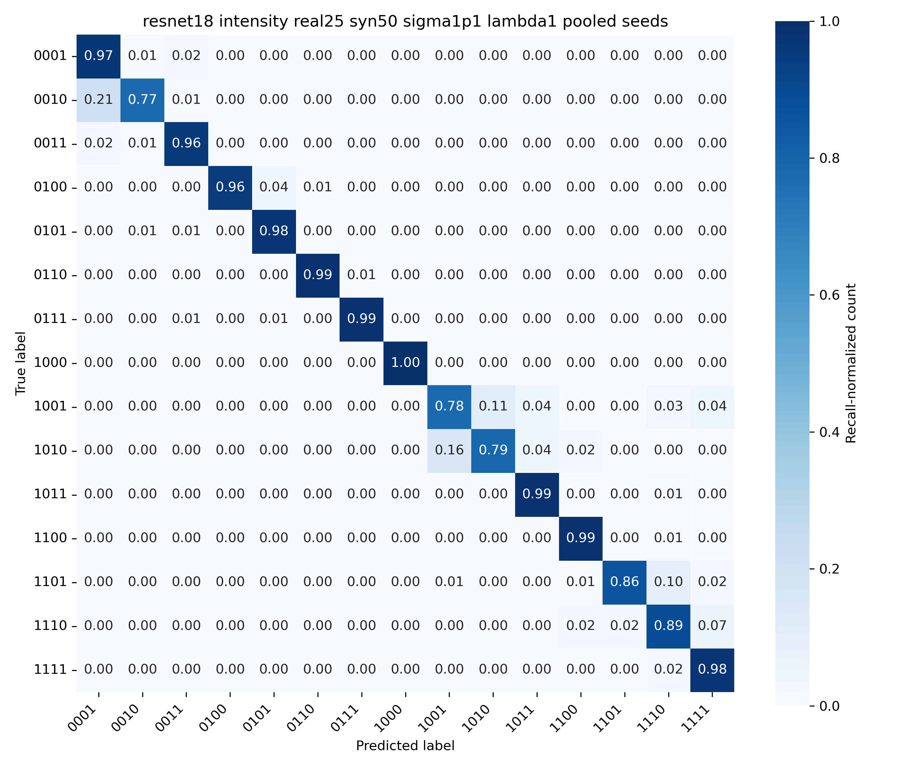
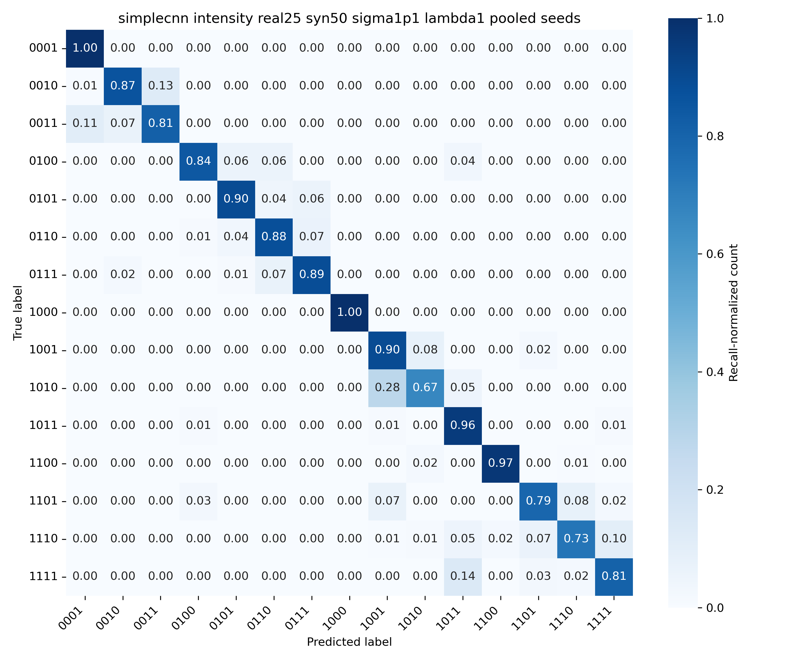

# IS-ML-classifier-code

Code for the IS-ML study of stochastic structured-light propagation, OAM-source classification, and diffusion-based generative augmentation.

The repository follows the numerical pipeline used in the final manuscript:

1. simulate propagated intensity fields from a stochastic paraxial propagation model;
2. train class-conditioned diffusion generators on propagated samples;
3. train SimpleCNN and ResNet-18 classifiers on real, generated, or mixed real-generated data.

The public entry points are:

- `run_simulation.py`
- `train_conditional_diffusion.py`
- `run_classification.py`

All entry scripts use explicit in-script configuration blocks rather than command-line arguments.

## Paper Defaults

The default configuration matches the final manuscript setting unless explicitly overridden:

- source alphabet: the 15 nonzero binary superpositions of `(p,l) in {(0,1), (1,4), (0,-6), (1,8)}`
- propagation setting: `z = 5`, `sigma = 1.1`, `l0 = 1.5`
- grid: `Lx = 64`, `Nx = 2048`, `dz = 1/32`
- beam waist: `w0 = 4`
- source total power: `total_power = 1e5`
- learning canvas: deterministic average pooling from `2048 x 2048` to `256 x 256`
- classifier crop: centered `64 x 64` window unless a shift preset is selected
- classifier split: 50% train, 20% validation, 30% test, stratified by class
- classifier training: Adam, weight decay `1e-5`, batch size `32`, 500 epochs, best-validation checkpoint
- reported classifier seeds in the paper: `42`, `100`, and `2023`
- diffusion model: class-conditioned DDPM U-Net, `v_prediction` default, `v_prediction` loss space, Fourier Bregman frequency weight `lambda = 1`

The code parameter name `sigma` corresponds to the manuscript parameter `sigma_0` in the PSD prefactor. With `k0 = 0.5`, the manuscript diffraction factor reduces to the propagation convention used in the solver.

## Representative Figures

The dataset overview shows the 15 source classes and representative propagated intensities under the final default setting.


The generated comparison shows simulated propagated samples and generated samples under the default diffusion configuration used for the final codebook figure.


The following confusion matrices correspond to the Real-25 + Syn-50, `v_prediction / v_prediction`, `lambda = 1` setting in the final manuscript.





## Repository Structure

```text
IS-ML-classifier-code/
├── classification_utils/       # preprocessing, models, training, experiment runner
├── generation_utils/           # DDPM datasets, scheduler mappings, losses, pipeline
├── simulation_utils/           # source-beam construction and split-step propagation
├── fig/                        # lightweight README figures
├── run_simulation.py           # generate propagated datasets
├── train_conditional_diffusion.py
├── run_classification.py
├── environment.yml
└── README.md
```

Large datasets, checkpoints, generated samples, and processed outputs are intentionally excluded from git.

## Environment

Recommended Python version: `3.10` or `3.11`.

```bash
conda env create -f environment.yml
conda activate isml
```

The diffusion pipeline uses `accelerate`, `diffusers`, and `ema-pytorch`. The classifier LR range test uses `torch-lr-finder`; set `use_lr_finder = False` in `run_classification.py` to use the fallback learning rates.

## Data Layout

Runtime data are expected under the following repository-relative layout:

```text
data/raw/dataset_z-5.00_sigma-1.1_l0-1.5_Nx-2048/
├── inputs_2048/
├── inputs_256/
├── metadata_2048.csv
├── metadata_256.csv
├── metadata.csv
└── summary.json
```

The scripts create output directories automatically:

- `data/raw/` stores propagated simulation datasets.
- `results/` stores diffusion checkpoints and generated samples.
- `data/processed/` stores classification summaries, histories, checkpoints, and optional confusion matrices.

The final-manuscript data are too large for git. To reproduce the paper-level runs, either place the current database at the path above or regenerate it with `run_simulation.py`.

## 1. Generate the Propagated Dataset

`run_simulation.py` generates the default propagated-intensity dataset:

- 15 nonzero binary OAM-source classes
- 150 propagated samples per class
- `2048 x 2048` raw intensities
- `256 x 256` average-pooled intensities
- metadata files for both resolutions

Run:

```bash
python run_simulation.py
```

Default output:

```text
data/raw/dataset_z-5.00_sigma-1.1_l0-1.5_Nx-2048/
```

## 2. Train the Conditional Diffusion Generator

`train_conditional_diffusion.py` implements the paper-level conditional DDPM protocol:

- input resolution `256 x 256`
- min-max normalization to `[-1, 1]`
- prediction target `v_prediction`
- loss space `v_prediction`
- pixel MSE plus Fourier-domain Bregman regularizer
- default frequency-loss weight `lambda = 1`
- 70/30 train/validation split
- AdamW, learning rate `1e-4`, 200 epochs
- 50 generated samples per class

Run:

```bash
python train_conditional_diffusion.py
```

Default output:

```text
results/generation_z-5.00_sigma-1.1_l0-1.5_Nx-2048_pred-v_prediction_loss-v_prediction_lambda-1.0_res-256_seed-42/
```

Generated samples are written under per-class folders such as:

```text
class-1/stage5_pretrained_data/generated_class-1_sample-0000.npy
```

## 3. Run Classification Experiments

`run_classification.py` contains presets corresponding to the classifier studies in the manuscript. Select a preset by editing `PRESET_NAME` near the top of the file.

Available presets:

- `baseline_intensity`: Real-50, cropped intensity input, SimpleCNN and ResNet-18.
- `baseline_acf`: Real-50, ACF input, SimpleCNN and ResNet-18.
- `real25_intensity`: Real-25 training-size setting.
- `real75_intensity`: Real-75 training-size setting.
- `random_shift_16`: random-shift training with `S = 16`, centered testing.
- `random_shift_32`: random-shift training with `S = 32`, centered testing.
- `random_shift_48`: random-shift training with `S = 48`, centered testing.
- `gen_aug_vv`: Real-25 + Syn-50 using the default `v_prediction / v_prediction`, `lambda = 1` generator.

Run:

```bash
python run_classification.py
```

Default output is written to a directory of the form:

```text
data/processed/classification_z-5.00_sigma-1.1_l0-1.5_Nx-2048_crop-64x64_input-intensity_pad-zeros_shift-0-fixed_eval-center_test_seed-42/
```

Each run writes `summary.csv`, per-model training histories, checkpoints, and optional confusion matrices.

## Notes on Reproducing Tables

The paper reports means and standard deviations over seeds `42`, `100`, and `2023`. To reproduce a table entry, run the corresponding preset once per seed by setting `OVERRIDES = {"random_seed": <seed>}` in `run_classification.py`, then aggregate the resulting `summary.csv` files.

For generator-comparison rows, train or provide generated samples for the desired pair of `prediction_type` and `loss_target_type`, then update `generated_data_root` in `run_classification.py`. The manuscript uses the following generated configurations:

- `sample / v_prediction` for `x`-pred / `v`-loss;
- `v_prediction / sample` for `v`-pred / `x`-loss;
- `v_prediction / v_prediction` for `v`-pred / `v`-loss;
- `v_prediction / epsilon` for `v`-pred / epsilon-loss.

The default public preset is `v_prediction / v_prediction`, because it is the default-`lambda` configuration emphasized in the final manuscript.
