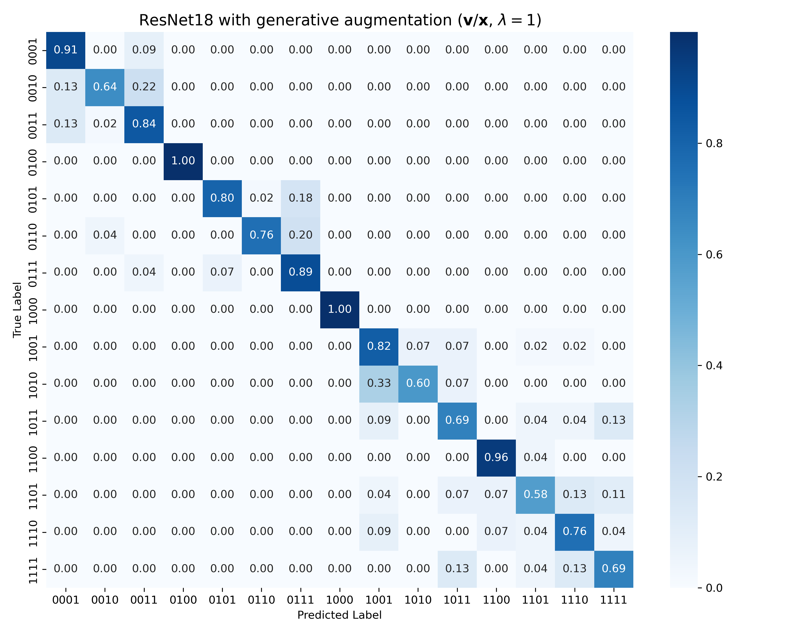

# IS-ML-classifier-code

Code for the IS-ML project on stochastic beam propagation, image-based OAM classification, and diffusion-based generative augmentation.

This repository is organized around the three main components studied in the paper:
- `simulation_utils/`: stochastic beam propagation and dataset generation
- `classification_utils/`: cropped-intensity and ACF-based classification
- `generation_utils/`: conditional diffusion training and class-conditional sample generation

The three public entry points are:
- `run_simulation.py`
- `train_conditional_diffusion.py`
- `run_classification.py`

## Overview

The paper studies classification of structured optical fields after propagation through a random medium. The public code follows the same order as the numerical pipeline in the manuscript:

1. generate propagated datasets by stochastic simulation;
2. train a conditional diffusion model on propagated samples;
3. evaluate classification with or without generated-data augmentation.

The default setting in the repository matches the main setting used in the paper:
- propagation distance `z = 5`
- medium-strength parameter `sigma = 5e-5`
- grid size `Nx = 2048`
- downsampled learning resolution `256 x 256`
- centered test protocol with crop size `64 x 64`

## Representative Results

The first figure shows the simulated codebook used in the classification task. The left panel contains the `15` source patterns, and the right panel contains the corresponding propagated intensity patterns under the default random-medium setting.


The next figure compares simulated propagated samples with the outputs of the best conditional diffusion configuration used in the paper (`v`-prediction, sample-space loss, frequency-loss weight `lambda = 1`). The generated codebook reproduces the coarse class structure and the principal speckle statistics of the simulated data.


The final figure shows the normalized confusion matrix for the best generative-augmentation result reported in the paper: `ResNet18` with generated samples from the `v/x` setting. Most of the mass remains concentrated on the diagonal, with residual confusion limited to a small number of nearby classes.



## Repository Structure

```text
IS-ML-classifier-code/
├── classification_utils/
├── data/
├── figures/
├── generation_utils/
├── run_classification.py
├── run_simulation.py
├── simulation_utils/
├── tests/
└── train_conditional_diffusion.py
```

The repository is intentionally kept flat. The reusable modules are exposed directly at the repository root, and the main executable scripts are placed alongside them.

## Environment

Recommended Python version:
- `3.10` or `3.11`

An environment file is provided at the repository root:

```bash
conda env create -f environment.yml
conda activate isml
```

Core dependencies by module:
- simulation: `numpy`, `scipy`, `tqdm`
- classification: `numpy`, `pandas`, `matplotlib`, `scikit-learn`, `torch`
- generation: `numpy`, `pandas`, `torch`, `diffusers`, `accelerate`, `ema-pytorch`

You can run the lightweight regression tests from the repository root:

```bash
python -m unittest tests/test_simulation.py tests/test_classification.py
```

## Data Layout

The repository uses the following directory convention:
- `data/raw/` stores simulated datasets
- `data/processed/` stores classification outputs
- `results/` stores diffusion checkpoints and generated samples
- `figures/` stores manuscript figures and exported visual summaries

Under the default configuration:
- `run_simulation.py` writes a dataset to `data/raw/dataset_z-5.00_sigma-5e-05/`
- `train_conditional_diffusion.py` reads from `data/raw/` and writes to `results/generation_.../`
- `run_classification.py` reads from `data/raw/` and writes to `data/processed/classification_.../`

Large datasets, generated samples, and checkpoints are excluded from git by default.

## Modules

### Simulation

The simulation module is built around:
- `simulation_utils/beam_creation.py`
- `simulation_utils/beam_propagation.py`
- `simulation_utils/simulation_class.py`

It generates class-conditional propagated intensity fields and exports both `2048 x 2048` and `256 x 256` arrays together with metadata tables.

### Generation

The generation module is built around:
- `generation_utils/datasets.py`
- `generation_utils/losses.py`
- `generation_utils/diffusion.py`
- `generation_utils/pipeline.py`

It covers conditional diffusion training and export of class-conditional synthetic samples for augmentation.

### Classification

The classification module is built around:
- `classification_utils/models.py`
- `classification_utils/datasets.py`
- `classification_utils/training.py`
- `classification_utils/experiment.py`

It covers cropped-intensity and ACF inputs, the controlled crop-and-shift protocol, and the `SimpleCNN` / `ResNet18` classifiers used in the paper.

## Usage

### 1. Generate a default dataset

`run_simulation.py` generates the default propagated-intensity dataset:
- `15` nonzero binary classes from the default mode dictionary
- `150` samples per class
- `Lx = 64`
- `Nx = 2048`
- `z = 5`
- `dz = 1/32`
- `sigma = 5e-5`
- `l0 = 1.5`

Run:

```bash
python run_simulation.py
```

Outputs:
- `data/raw/dataset_z-5.00_sigma-5e-05/inputs_2048/*.npy`
- `data/raw/dataset_z-5.00_sigma-5e-05/inputs_256/*.npy`
- `data/raw/dataset_z-5.00_sigma-5e-05/metadata_2048.csv`
- `data/raw/dataset_z-5.00_sigma-5e-05/metadata_256.csv`
- `data/raw/dataset_z-5.00_sigma-5e-05/summary.json`

### 2. Train the conditional diffusion model

`train_conditional_diffusion.py` runs the default generation pipeline:
- input resolution `256 x 256`
- `v`-prediction
- sample-space loss
- frequency-loss weight `lambda = 1`
- `50` generated samples per class

Run:

```bash
python train_conditional_diffusion.py
```

Outputs:
- best pretrained checkpoint
- training summaries
- generated samples in `results/generation_.../class-*/stage5_pretrained_data/`

### 3. Run the baseline classification experiment

`run_classification.py` runs the default baseline classification setting:
- centered test protocol
- crop size `64 x 64`
- zero padding
- no generated-data augmentation
- `SimpleCNN` and `ResNet18`

Run:

```bash
python run_classification.py
```

Outputs:
- `data/processed/classification_.../summary.csv`
- training histories
- checkpoints
- optional confusion matrices

All three entry scripts use explicit configuration blocks near the top of the file. To change the physical setting, dataset size, classifier, or generative model, edit the corresponding `CONFIG` dictionary.
